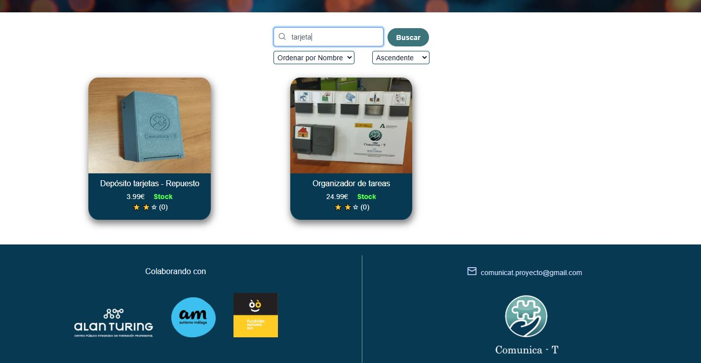
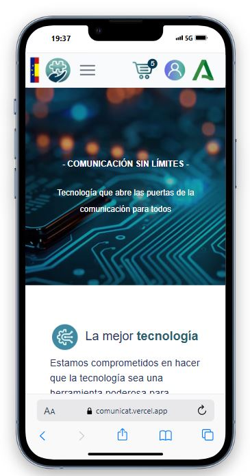
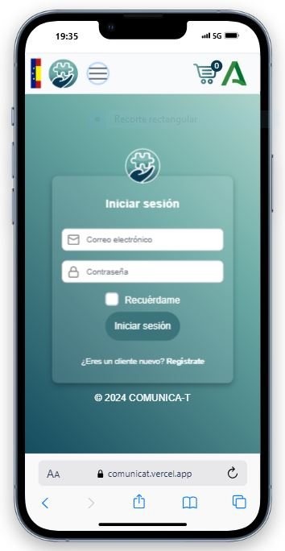

Proyecto fullstack de Ecommerce basado en una tienda de dispositivos que ayudan a niños del espectro Autista, realizado con ASP.NET y Angular.

Funcionalidades a destacar del proyecto:

- **Registro e inicio de sesión:** Implementa un sistema seguro de registro e inicio de sesión utilizando JSON Web Tokens (JWT) permitiendo la autenticación de usuarios y el acceso controlado, asegurando una experiencia segura.
  
- **Pago con tarjeta y blockchain:** Pago con tarjeta usando Stripe, como con blockchain en Ethereum y MetaMask en el navegador.

- **Vista de administrador:** Panel de control para la gestión y creación de productos y usuarios.

- **Inteligencia Artificial para calificar las reseñas:** Implementa un sistema de IA capaz de evaluar y clasificar las reseñas de los usuarios en malas, neutras o buenas.

- **Busqueda inteligente:** Incorpora un motor de búsqueda avanzado que ofrece resultados precisos incluso si hay errores tipográficos al escribir.

- **Diseño resposivo:** Diseño adaptado a cualquier tamaño de pantalla.

 

## Accede a la Página

[www.proyectocomunica-t.com](https://www.proyectocomunica-t.com/)

 

## Capturas

 

 

## Tecnologías

 

      
    
    
    
    
    
    
    

 

## Herramientas de Desarrollo

  <!-- Visual Studio Code -->
    
  <!-- Visual Studio 2022 -->
    

## Pago con tarjeta 

 

Para el procesamiento de pagos con tarjeta, utilizamos Stripe, una plataforma tecnológica que facilita la infraestructura necesaria para gestionar pagos en línea. 

En este momento, el sistema está en modo de prueba, por lo que es necesario utilizar las tarjetas de prueba proporcionadas en la documentación oficial de Stripe para realizar transacciones.

- [Tarjetas para pagos exitosos](https://docs.stripe.com/testing?locale=es-ES&testing-method=card-numbers#cards)

- [Tarjetas para pagos rechazados](https://docs.stripe.com/testing?locale=es-ES&testing-method=card-numbers#pagos-rechazados)

 

## Pago en Ethereum 

Para realizar los pagos con Ethereum utilizamos la extensión de MetaMask y la red de prueba de [Ephemery](https://ephemery.dev/).

 

Proyecto del segundo año del ciclo formativo de grado superior en Desarrollo de Aplicaciones Multiplataforma, en el centro C.P.I.F.P. Alan Turing.

Curso 2024/2025

